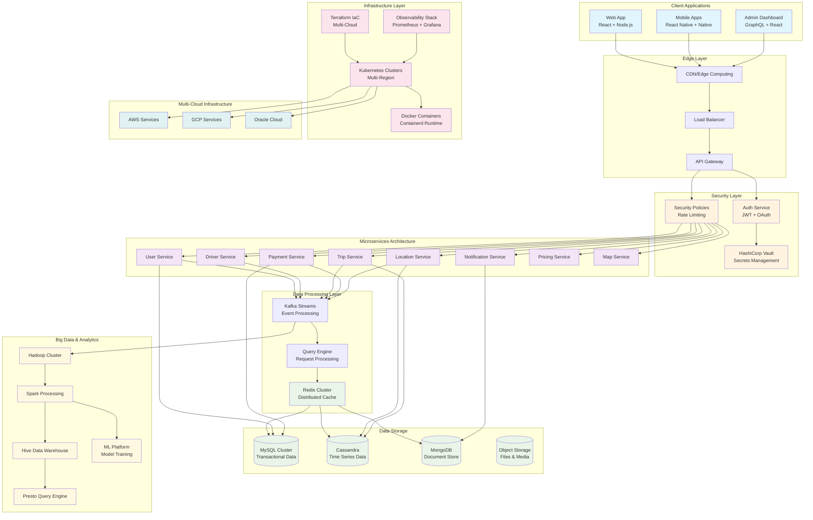

# Comprehensive Uber System Architecture Analysis

## System Overview

The Uber system architecture represents a sophisticated, enterprise-grade distributed system designed to handle millions of concurrent users across global markets. The architecture follows modern cloud-native principles with microservices, event-driven architecture, and multi-cloud deployment strategies.

## Detailed Component Analysis

### 1. Client Applications Layer

**Web Application Stack:**
- **React Frontend**: Provides responsive, interactive user interfaces
- **Node.js Backend**: Handles server-side rendering and API orchestration
- **GraphQL**: Enables efficient data fetching with flexible queries
- **Real-time Updates**: WebSocket connections for live tracking and notifications

**Mobile Application Stack:**
- **React Native**: Cross-platform development with shared business logic
- **Native Components**: Platform-specific optimizations for critical features
- **Offline Capabilities**: Local data storage and sync when connectivity resumes
- **Push Notifications**: Real-time driver/rider communication

### 2. Edge and Gateway Layer

**Content Delivery Network (CDN):**
- Global edge locations for reduced latency
- Static asset caching (images, JavaScript, CSS)
- Geographic routing based on user location
- DDoS protection and traffic filtering

**API Gateway:**
- Request routing and load balancing
- Rate limiting and throttling
- API versioning and backward compatibility
- Request/response transformation
- Circuit breaker patterns for fault tolerance

### 3. Security and Authentication

**Authentication Service:**
- JWT token-based authentication
- OAuth2/OpenID Connect integration
- Multi-factor authentication (MFA)
- Session management and token refresh
- Role-based access control (RBAC)

**Security Infrastructure:**
- HashiCorp Vault for secrets management
- Certificate management and rotation
- Network security policies
- Data encryption at rest and in transit
- Compliance with PCI DSS, GDPR, CCPA

### 4. Microservices Architecture

**Core Business Services:**

**User Service:**
- User registration and profile management
- Preference settings and history
- Account verification and KYC processes
- User analytics and behavior tracking

**Driver Service:**
- Driver onboarding and verification
- Document management and validation
- Driver availability and status tracking
- Performance metrics and ratings

**Trip Service:**
- Trip lifecycle management (request, match, start, complete)
- Route optimization and ETA calculations
- Trip history and receipts
- Pricing calculations and surge management

**Payment Service:**
- Multiple payment method support
- Transaction processing and reconciliation
- Fraud detection and prevention
- Financial reporting and compliance
- Refund and dispute management

**Location Service:**
- Real-time GPS tracking
- Geofencing and area management
- Route planning and navigation
- Location history and analytics

**Notification Service:**
- Push notifications to mobile devices
- SMS and email notifications
- In-app messaging system
- Notification preferences and scheduling

### 5. Data Processing and Event Streaming

**Apache Kafka:**
- High-throughput event streaming
- Event sourcing for audit trails
- Real-time data pipelines
- Message durability and replay capabilities
- Schema registry for data governance

**Query Engine:**
- Request parsing and validation
- Query optimization and execution planning
- Caching strategy implementation
- Response aggregation and formatting

**Redis Cluster:**
- Distributed caching layer
- Session storage
- Real-time data (driver locations, availability)
- Pub/sub messaging for real-time updates
- Rate limiting and throttling data

### 6. Data Storage Strategy

**MySQL Cluster:**
- ACID transactions for financial data
- User profiles and authentication data
- Referential integrity enforcement
- Master-slave replication for read scaling
- Automated backup and recovery

**Apache Cassandra:**
- Time-series data storage
- Trip histories and location tracking
- High write throughput capabilities
- Multi-datacenter replication
- Linear scalability

**MongoDB:**
- Document-based flexible schema
- User preferences and settings
- Content management
- Geospatial queries and indexing
- Horizontal sharding capabilities

### 7. Big Data and Analytics Platform

**Hadoop Ecosystem:**
- Distributed file system (HDFS)
- Batch processing capabilities
- Data lake architecture
- Long-term data retention

**Apache Spark:**
- In-memory processing for faster analytics
- Machine learning model training
- Real-time stream processing
- ETL pipeline processing

**Apache Hive:**
- SQL-like query interface
- Data warehousing capabilities
- Schema management
- Integration with BI tools

**Presto/Trino:**
- Interactive query engine
- Cross-database querying
- Ad-hoc analytics
- Business intelligence reporting

### 8. Infrastructure and Orchestration

**Kubernetes:**
- Container orchestration across multiple clusters
- Automatic scaling based on metrics
- Rolling deployments and rollbacks
- Service mesh integration (Istio/Linkerd)
- Multi-region deployment management

**Docker/Containerd:**
- Application containerization
- Lightweight runtime environment
- Image layer caching
- Security scanning and compliance

**Terraform:**
- Infrastructure as Code (IaC)
- Multi-cloud resource provisioning
- State management and drift detection
- Modular infrastructure components
- Environment consistency

## Pros and Cons Analysis

### Advantages

**Scalability:**
- Independent scaling of microservices
- Horizontal scaling capabilities
- Multi-cloud distribution
- Auto-scaling based on demand patterns

**Reliability:**
- Multiple layers of redundancy
- Circuit breaker patterns
- Graceful degradation
- Disaster recovery capabilities

**Performance:**
- Distributed caching strategy
- CDN for global content delivery
- Optimized database choices for specific use cases
- Event-driven architecture for real-time updates

**Maintainability:**
- Clear separation of concerns
- Independent deployment cycles
- Comprehensive monitoring and observability
- Infrastructure as Code for consistency

**Flexibility:**
- Technology diversity across services
- Multi-cloud strategy prevents vendor lock-in
- Modular architecture allows incremental updates
- Support for multiple client platforms

### Disadvantages

**Complexity:**
- High operational overhead
- Complex debugging across distributed services
- Network latency between services
- Data consistency challenges

**Cost:**
- Resource intensive infrastructure
- Multi-cloud management overhead
- Specialized skill requirements
- Monitoring and tooling costs

**Development Challenges:**
- Distributed system complexity
- Service coordination difficulties
- Testing complexity across services
- Deployment orchestration challenges

**Data Management:**
- Eventual consistency issues
- Cross-service transaction management
- Data synchronization across multiple stores
- Backup and recovery complexity

## Areas for Improvement

### 1. Service Mesh Implementation
- **Current Gap**: Limited inter-service communication management
- **Improvement**: Implement Istio or Linkerd for:
  - Traffic management and load balancing
  - Security policies and mTLS
  - Observability and distributed tracing
  - Circuit breaking and fault injection

### 2. Advanced Monitoring and Observability
- **Current Gap**: Basic monitoring setup
- **Improvement**: Implement comprehensive observability:
  - Distributed tracing with Jaeger/Zipkin
  - Application Performance Monitoring (APM)
  - Business metrics and KPI dashboards
  - Anomaly detection and alerting

### 3. Data Governance and Quality
- **Current Gap**: Limited data governance framework
- **Improvement**: Implement data governance:
  - Data catalog and lineage tracking
  - Data quality monitoring and validation
  - Privacy compliance automation
  - Schema evolution management

### 4. Edge Computing Enhancement
- **Current Gap**: Limited edge processing capabilities
- **Improvement**: Implement edge computing:
  - Location-based service processing at edge
  - Offline-first mobile architecture
  - Edge analytics for real-time decisions
  - 5G network optimization

### 5. Advanced Security Measures
- **Current Gap**: Basic security implementation
- **Improvement**: Enhanced security:
  - Zero-trust network architecture
  - Runtime security monitoring
  - Automated vulnerability scanning
  - Advanced threat detection

### 6. Machine Learning Operations (MLOps)
- **Current Gap**: Manual ML model management
- **Improvement**: Implement MLOps pipeline:
  - Automated model training and deployment
  - A/B testing for ML models
  - Model monitoring and drift detection
  - Feature store implementation

### 7. Database Optimization
- **Current Gap**: Generic database configurations
- **Improvement**: Database specialization:
  - Read replicas in multiple regions
  - Database sharding strategies
  - Automated database scaling
  - Cross-region data synchronization

### 8. Disaster Recovery Enhancement
- **Current Gap**: Basic backup strategies
- **Improvement**: Comprehensive DR:
  - Multi-region active-active setup
  - Automated failover mechanisms
  - Data replication strategies
  - Regular disaster recovery testing

### 9. Cost Optimization
- **Current Gap**: Limited cost monitoring
- **Improvement**: Cost management:
  - Resource usage optimization
  - Spot instance utilization
  - Reserved capacity planning
  - Multi-cloud cost comparison

### 10. Developer Experience
- **Current Gap**: Complex development environment
- **Improvement**: Enhanced DX:
  - Local development environment standardization
  - Automated testing frameworks
  - Self-service infrastructure provisioning
  - Developer productivity metrics

## Technology Stack Alternatives

### Container Orchestration
- **Current**: Kubernetes
- **Alternatives**: 
  - Amazon ECS/Fargate for simpler operations
  - HashiCorp Nomad for multi-cloud flexibility
  - Docker Swarm for smaller deployments

### Message Streaming
- **Current**: Apache Kafka
- **Alternatives**:
  - Amazon Kinesis for managed streaming
  - Apache Pulsar for geo-replication
  - Google Pub/Sub for serverless messaging

### Database Options
- **Current**: MySQL, Cassandra, MongoDB
- **Alternatives**:
  - PostgreSQL for better JSON support
  - Amazon DynamoDB for managed NoSQL
  - CockroachDB for distributed SQL

### Monitoring Stack
- **Current**: Basic monitoring
- **Alternatives**:
  - Datadog for comprehensive monitoring
  - New Relic for APM
  - Elastic Stack for log analysis

## Performance Optimization Strategies

### 1. Caching Strategy
- Multi-level caching (L1: Application, L2: Redis, L3: CDN)
- Cache warming strategies
- Cache invalidation patterns
- Regional cache distribution

### 2. Database Performance
- Connection pooling optimization
- Query optimization and indexing
- Read replica distribution
- Database connection management

### 3. Network Optimization
- Service mesh for intelligent routing
- Connection pooling and keep-alive
- Compression algorithms
- Regional data placement

### 4. Application Performance
- Code profiling and optimization
- Memory management
- Garbage collection tuning
- Asynchronous processing patterns

## Security Best Practices

### 1. Zero Trust Architecture
- Never trust, always verify principle
- Micro-segmentation of network
- Identity-based access controls
- Continuous security monitoring

### 2. Data Protection
- Encryption at rest and in transit
- Key rotation policies
- Data classification and handling
- Privacy by design principles

### 3. Application Security
- OWASP Top 10 compliance
- Regular security assessments
- Dependency vulnerability scanning
- Secure coding practices

### 4. Infrastructure Security
- Immutable infrastructure
- Regular security patching
- Container image scanning
- Network security policies

### 5. Infrastructure components

## Conclusion

The Uber system architecture demonstrates a mature, production-ready distributed system that can handle massive scale while maintaining reliability and performance. The architecture successfully addresses the complex requirements of a global ride-sharing platform through careful technology choices and architectural patterns.

The key strengths lie in its scalability, reliability, and flexibility, while the main challenges involve managing complexity and operational overhead. The suggested improvements focus on enhancing observability, implementing advanced security measures, and optimizing performance through better tooling and practices.

This architecture serves as an excellent reference for building large-scale, distributed systems that require high availability, real-time processing, and global reach.
